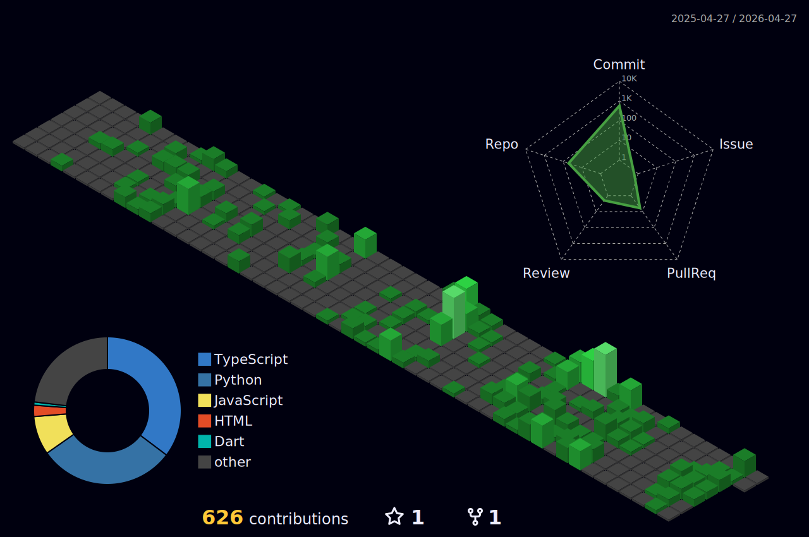

# > ACCESSING MATRIX PROTOCOL: NEO.EXE
---

```
> INITIALIZING...
> BYPASSING FIREWALL... [DONE]
> ESTABLISHING SECURE CONNECTION... [DONE]  
> LOADING PROFILE: M_S_RISHAV_SUBHIN...
```


```diff
+                                                                                 
+         ███╗   ███╗    ███████╗    ██████╗ ██╗███████╗██╗  ██╗ █████╗ ██╗   ██╗
+         ████╗ ████║    ██╔════╝    ██╔══██╗██║██╔════╝██║  ██║██╔══██╗██║   ██║
+         ██╔████╔██║    ███████╗    ██████╔╝██║███████╗███████║███████║██║   ██║
+         ██║╚██╔╝██║    ╚════██║    ██╔══██╗██║╚════██║██╔══██║██╔══██║╚██╗ ██╔╝
+         ██║ ╚═╝ ██║    ███████║    ██║  ██║██║███████║██║  ██║██║  ██║ ╚████╔╝ 
+         ╚═╝     ╚═╝    ╚══════╝    ╚═╝  ╚═╝╚═╝╚══════╝╚═╝  ╚═╝╚═╝  ╚═╝  ╚═══╝  
+                                         
+                        ███████╗██╗   ██╗██████╗ ██╗  ██╗██╗███╗   ██╗
+                        ██╔════╝██║   ██║██╔══██╗██║  ██║██║████╗  ██║
+                        ███████╗██║   ██║██████╔╝███████║██║██╔██╗ ██║
+                        ╚════██║██║   ██║██╔══██╗██╔══██║██║██║╚██╗██║
+                        ███████║╚██████╔╝██████╔╝██║  ██║██║██║ ╚████║
+                        ╚══════╝ ╚═════╝ ╚═════╝ ╚═╝  ╚═╝╚═╝╚═╝  ╚═══╝
+                                                                                
```


</div>

---

<div align="center">
  <video src="https://github.com/user-attachments/assets/37c33622-be66-4089-b497-0218de3de26d" controls loop width="600"></video>
</div>


---

## > MORPHEUS IS CALLING YOU...

> *"This is your last chance. After this, there is no turning back."*

<div align="center">

<div align="center">
  <video src="https://github.com/user-attachments/assets/b6283c52-6690-4a8b-8f0d-992ec79378e6" controls loop width="600"></video>
</div>


**You take the blue pill** - the story ends, you wake up in your bed and believe whatever you want to believe.

**You take the red pill** - you stay in Wonderland, and I show you how deep the rabbit hole goes.

```
choice = input("Red pill or Blue pill? ")
if choice.lower() == "red pill":
    print("Welcome to the real world.")
    reality.load_matrix_profile()
```

</div>

---

## > OPERATIVE PROFILE: THE ONE

<div align="center">
  
</div>


<div align="center">

### **M S RISHAV SUBHIN** | *Neo.exe*
**`AI/ML Engineer • Third-Year • Bengaluru Node`**

[](https://portfolio-msrishav.vercel.app/)
[](https://linkedin.com/in/m-s-rishav-subhin)
[](https://github.com/msrishav-28)

</div>

---

## > MATRIX CODE ANALYSIS

<div align="center">

[](https://github.com/msrishav-28)

[](https://github.com/msrishav-28)

[](https://github.com/msrishav-28)

[](https://github.com/msrishav-28)
[](https://github.com/msrishav-28)

[](https://github.com/msrishav-28)
[](https://github.com/msrishav-28)

</div>

---

## > PROGRAMMING MATRIX: SKILL UPLOAD COMPLETE

```python
class TheOne:
    def __init__(self, codename="Rishav"):
        self.codename = codename
        self.status = "Awakened"
        self.location = "Bengaluru, India"
        self.level = "Third Year AI/ML Engineer"
        
    def load_skills(self):
        return {
            "Languages": ["Python", "JavaScript", "TypeScript", "Java", "C", "C++", "SQL", "HTML", "CSS"],
            "AI/ML": ["TensorFlow", "PyTorch", "Scikit-Learn", "Keras", "OpenCV", "Pandas", "NumPy", "Matplotlib"],
            "Frameworks": ["React", "Next.js", "Flask", "FastAPI", "Node.js", "Express.js", "Django"],
            "Databases": ["MongoDB", "PostgreSQL", "MySQL", "Firebase", "Redis"],
            "Cloud & DevOps": ["AWS", "GCP", "Docker", "Git", "GitHub Actions", "Vercel", "Netlify"],
            "Tools": ["VS Code", "Jupyter", "Postman", "Figma", "Linux"]
        }
        
Neo = TheOne()
print("Skills loaded successfully. Ready for deployment.")
```

<div align="center">

| **CATEGORY** | **TECHNOLOGIES** |
|:---:|:---|
| **Languages** |          |
| **AI/ML** |        |
| **Frameworks** |        |
| **Databases** |      |
| **Cloud & DevOps** |       |
| **Tools** |      |

</div>

---

## > WAKATIME CODING STATS: REAL-TIME METRICS

<div align="center">

<!--START_SECTION:waka-->
```text
⏳ WakaTime stats will appear here once configured.
   See setup instructions below for configuration steps.
```
<!--END_SECTION:waka-->

[](https://wakatime.com/@msrishav28)

</div>

---

## > MATRIX SOUNDTRACK: NOW PLAYING

<div align="center">

[](https://spotify-github-profile.kittinanx.com/api/view?uid=4825dcfda81f453c8d545f7c9f4aeb15&redirect=true)

</div>

```

## > ACTIVE MISSIONS: PROJECT MATRIX

| Mission Codename | Objective | Tech Stack | Status |
|---|---|---|---|
| **Nila-Shoshsho** | Agricultural soil analysis system | Python, ML | 🟢 DEPLOYED |
| **VibeMates** | Music collaboration platform | JavaScript, React | 🟢 ACTIVE |
| **ThinkChrist Notes** | Educational note-sharing platform | React, Firebase | 🟢 OPERATIONAL |
| **SkillSwap** | P2P skill exchange platform | Full-stack web | 🟢 LIVE |
| **Tekshila** | AI-powered code documentation | Python, AI | 🟢 DEPLOYED |
| **StockSage** | Financial analysis dashboard | Python, Data Science | 🟢 RUNNING |

---

## > LANGUAGE DISTRIBUTION: DECODING THE MATRIX

<div align="center">

[](https://github.com/msrishav-28)

</div>

---

## > CONTRIBUTION MATRIX: ACTIVITY GRAPH

<div align="center">

[](https://github.com/msrishav-28)

</div>

---

## > 3D CONTRIBUTION MATRIX

<div align="center">



<!-- 
Note: The 3D contribution graph is generated automatically daily at midnight UTC.
If the image doesn't appear, trigger the "Generate 3D Contribution Graph" workflow manually.
-->

</div>

---

## > SNAKE CONSUMING CONTRIBUTIONS

<div align="center">


<!-- 
Note: Snake animation updates every 6 hours with Matrix green theme.
Alternative versions available:
- github-contribution-grid-snake.svg (default)
- github-contribution-grid-snake-dark.svg (dark mode)
- github-contribution-grid-snake-matrix.svg (Matrix theme)
-->

</div>

---

## > ACHIEVEMENT UNLOCKED: TROPHIES

<div align="center">

[](https://github.com/msrishav-28)

</div>

---

## > RECENT ACTIVITY: MATRIX OPERATIONS

```bash
> Accessing recent commits...
> Scanning for anomalies...
> All systems operational.
```

<!--START_SECTION:activity-->
1. ❌ Reopened PR [#7](undefined) in [msrishav-28/msrishav-28](https://github.com/msrishav-28/msrishav-28)
<!--END_SECTION:activity-->

---

## > CONTACT PROTOCOL: ESTABLISH CONNECTION

> *"I know you're out there. I can feel you now."*

```python
def establish_contact():
    contact_methods = {
        "portfolio": "https://portfolio-msrishav.vercel.app/",
        "linkedin": "https://linkedin.com/in/m-s-rishav-subhin",
        "email": "professional.rishav@matrix.node",  # Replace with actual email
        "location": "Bengaluru, India",
        "timezone": "UTC +05:30"
    }
    
    print("Choose your communication channel:")
    for method, link in contact_methods.items():
        print(f"  {method}: {link}")
        
establish_contact()
```

---

## > MORPHEUS' WISDOM

<div align="center">
  
</div>

<div align="center">

*"I'm trying to free your mind, Neo, but I can only show you the door. You're the one that has to walk through it."*

*"There is no spoon."*

*"What is real? How do you define 'real'?"*

</div>

---

## > RANDOM DEV WISDOM FROM THE MATRIX

<div align="center">

[](https://github.com/msrishav-28)

</div>

---

## > LEETCODE MATRIX: PROBLEM SOLVING

<div align="center">

[](https://leetcode.com/msrishav28)

</div>

---

## > MATRIX STATISTICS: REAL-TIME FEED

<div align="center">


</div>

---

## > SETUP INSTRUCTIONS: CONFIGURE INTEGRATIONS

<div align="center">

### 🔧 **WakaTime Setup**
1. Sign up at [WakaTime](https://wakatime.com/)
2. Install WakaTime plugin for your IDE (VS Code, PyCharm, etc.)
3. Get your API key from [WakaTime Settings](https://wakatime.com/settings/api-key)
4. Add `WAKATIME_API_KEY` to GitHub repository secrets
5. The workflow will auto-update daily

### 🎵 **Spotify Setup**
1. Go to [Spotify Developer Dashboard](https://developer.spotify.com/dashboard)
2. Create a new app
3. Get your Spotify User ID from [Account Settings](https://www.spotify.com/account/overview/)
4. Replace `YOUR_SPOTIFY_USER_ID` in the README with your actual user ID
5. Widget updates automatically when you play music

</div>

---

```ascii
 ╔══════════════════════════════════════════════════════════╗
 ║                                                          ║
 ║  "The Matrix is a system, Neo. That system is our        ║
 ║   enemy. But when you're inside, you look around.        ║
 ║   What do you see? Businessmen, teachers, lawyers,       ║
 ║   carpenters. The very minds of the people we are        ║
 ║   trying to save."                                       ║
 ║                                     - Morpheus           ║
 ║                                                          ║
 ╚══════════════════════════════════════════════════════════╝
```

<div align="center">

### > END TRANSMISSION
**Welcome to the real world, Neo.**

---

</div>

<!-- 
Matrix Profile README by M S Rishav Subhin
"Free your mind" - Morpheus
-->
