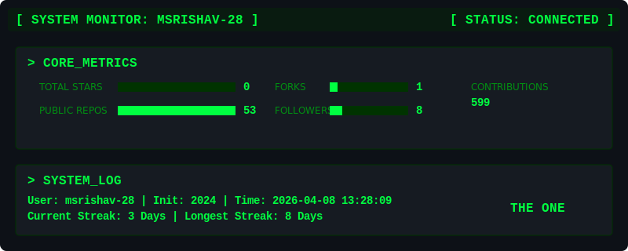

# > ACCESSING MATRIX PROTOCOL: ARCHITECT.EXE
---


<div align="center">
  <br>
  <code>[ SYSTEM ANOMALY DETECTED ]</code>
  <br>
  <code>⚠️ MATRIX INTEGRITY: UNSTABLE ⚠️</code>
</div>

```diff
+                                                                                 
+         ███╗   ███╗    ███████╗    ██████╗ ██╗███████╗██╗  ██╗ █████╗ ██╗   ██╗
+         ████╗ ████║    ██╔════╝    ██╔══██╗██║██╔════╝██║  ██║██╔══██╗██║   ██║
+         ██╔████╔██║    ███████╗    ██████╔╝██║███████╗███████║███████║██║   ██║
+         ██║╚██╔╝██║    ╚════██║    ██╔══██╗██║╚════██║██╔══██║██╔══██║╚██╗ ██╔╝
+         ██║ ╚═╝ ██║    ███████║    ██║  ██║██║███████║██║  ██║██║  ██║ ╚████╔╝ 
+         ╚═╝     ╚═╝    ╚══════╝    ╚═╝  ╚═╝╚═╝╚══════╝╚═╝  ╚═╝╚═╝  ╚═╝  ╚═══╝  
+                                         
+                        ███████╗██╗   ██╗██████╗ ██╗  ██╗██╗███╗   ██╗
+                        ██╔════╝██║   ██║██╔══██╗██║  ██║██║████╗  ██║
+                        ███████╗██║   ██║██████╔╝███████║██║██╔██╗ ██║
+                        ╚════██║██║   ██║██╔══██╗██╔══██║██║██║╚██╗██║
+                        ███████║╚██████╔╝██████╔╝██║  ██║██║██║ ╚████║
+                        ╚══════╝ ╚═════╝ ╚═════╝ ╚═╝  ╚═╝╚═╝╚═╝  ╚═══╝
+                                                                                
```

  

</div>

---

<div align="center">
  <video src="https://github.com/user-attachments/assets/37c33622-be66-4089-b497-0218de3de26d" controls loop width="600"></video>
</div>


---

## > MORPHEUS IS CALLING YOU...


<div align="center">

<div align="center">
  <video src="https://github.com/user-attachments/assets/b6283c52-6690-4a8b-8f0d-992ec79378e6" controls loop width="600"></video>
</div>


</div>

---

## > OPERATIVE PROFILE: THE ONE

<div align="center">
  
</div>

<div align="center">
  
</div>


<div align="center">

### **M S RISHAV SUBHIN** | *Neo.exe*
**`AI/ML Engineer • Third-Year • Bengaluru Node`**

[](https://portfolio-msrishav.vercel.app/)
[](https://linkedin.com/in/m-s-rishav-subhin)
[](mailto:ms.rishav289@gmail.com)

</div>

## > MATRIX CODE ANALYSIS

<picture>
  <source media="(prefers-color-scheme: dark)" srcset="https://streak-stats.demolab.com/?user=msrishav-28&theme=dark&hide_border=true&background=0d1117&fire=00FF41&currStreakNum=00FF41&sideNums=00FF41&currStreakLabel=00FF41&sideLabels=00FF41&dates=00FF41&ring=00FF41&border_radius=10">
  <source media="(prefers-color-scheme: light)" srcset="https://streak-stats.demolab.com/?user=msrishav-28&theme=default&hide_border=true&background=ffffff&fire=00cc33&currStreakNum=008000&sideNums=008000&currStreakLabel=00cc33&sideLabels=00cc33&dates=008000&ring=00cc33&border_radius=10">
  
</picture>

<!-- Unified Matrix Operator Dashboard -->


---

## > PROGRAMMING MATRIX: SKILL UPLOAD COMPLETE

<div align="center">

| **CATEGORY** | **TECHNOLOGIES** |
|:---:|:---|
| **Languages** |          |
| **AI/ML** |        |
| **Frameworks** |        |
| **Databases** |      |
| **Cloud & DevOps** |       |
| **Tools** |      |

</div>

---

## > ACTIVE MISSIONS: PROJECT MATRIX

| Mission Codename | Objective | Tech Stack | Status |
|---|---|---|---|
| **Nila-Shoshsho** | Agricultural soil analysis system | Python, ML | 🟢 DEPLOYED |
| **VibeMates** | Music collaboration platform | JavaScript, React | 🟢 ACTIVE |
| **ThinkChrist Notes** | Educational note-sharing platform | React, Firebase | 🟢 OPERATIONAL |
| **SkillSwap** | P2P skill exchange platform | Full-stack web | 🟢 LIVE |
| **Tekshila** | AI-powered code documentation | Python, AI | 🟢 DEPLOYED |
| **StockSage** | Financial analysis dashboard | Python, Data Science | 🟢 RUNNING |

---

## > LANGUAGE DISTRIBUTION: DECODING THE MATRIX

<div align="center">

<picture>
  <source media="(prefers-color-scheme: dark)" srcset="https://github-readme-stats.vercel.app/api/top-langs/?username=msrishav-28&layout=compact&theme=dark&hide_border=true&bg_color=0d1117&title_color=00ff41&text_color=00ff41&border_radius=10">
  <source media="(prefers-color-scheme: light)" srcset="https://github-readme-stats.vercel.app/api/top-langs/?username=msrishav-28&layout=compact&theme=default&hide_border=true&bg_color=ffffff&title_color=008000&text_color=008000&border_radius=10">
  
</picture>

</div>

---

## > CONTRIBUTION MATRIX: ACTIVITY GRAPH

<div align="center">

<picture>
  <source media="(prefers-color-scheme: dark)" srcset="https://github-readme-activity-graph.vercel.app/graph?username=msrishav-28&bg_color=0d1117&color=00ff41&line=00ff41&point=00ff41&area=true&area_color=00ff41&hide_border=true&custom_title=Matrix%20Activity%20Graph&theme=github-dark&radius=10">
  <source media="(prefers-color-scheme: light)" srcset="https://github-readme-activity-graph.vercel.app/graph?username=msrishav-28&bg_color=ffffff&color=008000&line=00cc33&point=00cc33&area=true&area_color=99ffb3&hide_border=true&custom_title=Matrix%20Activity%20Graph&theme=github-light&radius=10">
  
</picture>

</div>

---

## > 3D CONTRIBUTION MATRIX

<div align="center">


<!-- 
Note: The 3D contribution graph is generated automatically daily at midnight UTC.
Generated using yoshi389111/github-profile-3d-contrib with Matrix green theme.
Supports both light and dark modes automatically using GitHub's theme-aware image syntax.
Dark mode: profile-night-green.svg | Light mode: profile-green-animate.svg
If the image doesn't appear, trigger the workflow manually or check GitHub Actions.
-->

</div>

---

## > MATRIX CONTRIBUTIONS

<div align="center">



<!-- 
Note: Snake animation updates every 12 hours with Matrix green theme.
Generated using Platane/snk with custom Matrix green color palette.
Supports both light and dark modes automatically using GitHub's theme-aware image syntax.

Dark Mode:
- Background: #0d1117
- Levels: #00661a → #009929 → #00cc33 → #00ff41
- Snake: #00ff41

Light Mode:
- Background: #ebedf0
- Levels: #99ffb3 → #33ff66 → #00cc33 → #008000
- Snake: #008000

If the animation doesn't appear, check GitHub Actions workflow status.
-->

</div>

---

## > ACHIEVEMENT UNLOCKED: TROPHIES

<div align="center">


</div>

---

## > RECENT ACTIVITY: MATRIX OPERATIONS

```bash
> Accessing recent commits...
> Scanning for anomalies...
> All systems operational.
```

<!--START_SECTION:activity-->
<!--END_SECTION:activity-->

---


---

## > MORPHEUS' WISDOM

<div align="center">
  
</div>

<div align="center">

*"I'm trying to free your mind, Neo, but I can only show you the door. You're the one that has to walk through it."*

*"There is no spoon."*

*"What is real? How do you define 'real'?"*

</div>

---


## > MATRIX STATISTICS: REAL-TIME FEED

<div align="center">


</div>

---


<div align="center">

### > END TRANSMISSION
**Welcome to the real world, Neo.**

---

</div>

<!-- 
Matrix Profile README by M S Rishav Subhin
"Free your mind" - Morpheus
-->
